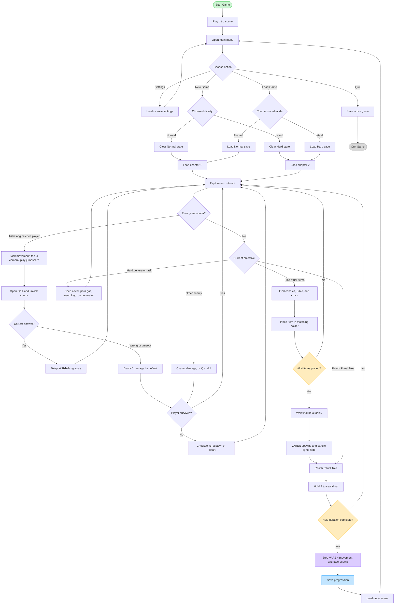

# VAREN Activity Diagram

This activity diagram shows the player's main game path, including Normal mode, Hard mode, loading, the ritual, the final sealing, and quitting.

## Activity Notes

- **Settings** is global and uses `settings.db`.
- **Normal** uses `gameSave_v2.db`; **Hard** uses `gameSave_Hard_v2.db`.
- The generator route is a Chapter 2 Hard-mode activity. It is only available after the gas tank cover is opened.
- The ritual route requires two candles, a Bible, and a cross.
- Completing the Ritual Tree sequence stops VAREN, saves progression, loads the outro, and returns the player to the main menu.
- Releasing `E`, looking away, or leaving interaction range before the final ritual duration is complete stops the current hold and allows the player to try again.
### Tikbalang Encounter Notes

- On first discovery, Tikbalang teleports in front of the player and plays its discovery sound; this is not a Q&A damage event.
- When it later catches the player, movement locks, the camera focuses on Tikbalang, and the Q&A panel opens.
- Wrong answers and timeouts deal 40 damage by default. After each result, Tikbalang teleports away and may catch the player again after its cooldown.