# VAREN Relational Save Relationships

Version 3 uses a real SQLite relational save schema. Each database contains one
`SaveProfileData` row (`Id = 1`) for the local single-player save. Every game-state
table stores `SaveProfileId`, which is a foreign key to that profile with
`ON DELETE CASCADE`.

```mermaid
erDiagram
    SaveProfileData ||--|| PlayerData : "owns"
    SaveProfileData ||--o{ InventoryData : "owns"
    SaveProfileData ||--o{ DoorData : "owns"
    SaveProfileData ||--o{ DrawerData : "owns"
    SaveProfileData ||--o{ DroppedItemData : "owns"
    SaveProfileData ||--o{ FlashlightData : "owns"
    SaveProfileData ||--o{ KeyData : "owns"
    SaveProfileData ||--o{ BatteryData : "owns"
    SaveProfileData ||--o{ RitualItemData : "owns"
    SaveProfileData ||--o{ NoteData : "owns"
    SaveProfileData ||--o{ SubtitleData : "owns"
    SaveProfileData ||--o{ AIPositionData : "owns"
    SaveProfileData ||--|| RitualData : "owns"
    SaveProfileData ||--|| StaminaData : "owns"
    SaveProfileData ||--|| ProgressionData : "owns"
    SaveProfileData ||--|| IntroData : "owns"
    SaveProfileData ||--o{ GameStateData : "owns"
    SaveProfileData ||--o{ WrenchData : "Chapter 2 only"
    SaveProfileData ||--o{ GasData : "Chapter 2 only"
    SaveProfileData ||--o{ GeneratorCoverData : "Chapter 2 only"
```

`gameSave_v2.db` uses the shared tables for Chapter 1. `gameSave_Hard_v2.db` also
includes the three Chapter 2 generator tables. `settings.db` stays separate because
it stores global menu settings, not player progress.

## Drawer relationship and identity

`DrawerData.SaveProfileId` is a foreign key to `SaveProfileData.Id`, so a drawer
record belongs to exactly one save profile. `DrawerId` is a stable Unity scene
identifier, not a foreign key. During loading, `SaveSystem` uses it to find the
matching `DrawerInteraction` object, then restores its saved open state and exact
local position. Deleting the save profile also deletes its drawer rows through
`ON DELETE CASCADE`.
