# VAREN Logical Save Relationships

> This is a **conceptual relationship diagram** for presentation and explanation.
> It does not add foreign keys or modify the SQLite database. Each save file holds
> one player's complete state, so `SaveFile` is a logical boundary rather than a
> real SQLite table.

```mermaid
erDiagram
    SAVE_FILE ||--|| PlayerData : "contains player state"
    SAVE_FILE ||--o{ InventoryData : "contains inventory rows"
    SAVE_FILE ||--o{ DoorData : "contains door states"
    SAVE_FILE ||--|| RitualData : "contains ritual state"
    SAVE_FILE ||--o{ NoteData : "contains read notes"
    SAVE_FILE ||--o{ GameStateData : "contains key-value state"
    SAVE_FILE ||--o{ DroppedItemData : "contains dropped items"
    SAVE_FILE ||--o{ FlashlightData : "contains flashlight state"
    SAVE_FILE ||--o{ KeyData : "contains used keys"
    SAVE_FILE ||--o{ BatteryData : "contains batteries"
    SAVE_FILE ||--o{ RitualItemData : "contains ritual items"
    SAVE_FILE ||--|| ProgressionData : "contains progress"
    SAVE_FILE ||--o{ SubtitleData : "contains subtitles"
    SAVE_FILE ||--|| StaminaData : "contains stamina"
    SAVE_FILE ||--o{ IntroData : "contains intro state"
    SAVE_FILE ||--o{ AIPositionData : "contains AI states"

    PlayerData ||--o{ AIPositionData : "scene context"
    InventoryData }o..o{ DroppedItemData : "item name logic"
    InventoryData }o..o{ BatteryData : "battery name logic"
    InventoryData }o..o{ KeyData : "key name logic"
    InventoryData }o..o{ RitualItemData : "item name logic"
```

## How to explain it

- `SAVE_FILE` means either `gameSave.db` for Chapter 1 or `gameSave_Hard.db` for Chapter 2.
- One save file contains one player's complete game state; therefore it is the
  logical parent of all saved rows.
- Solid relationship lines mean the save file owns the saved state.
- Dotted relationships mean Unity scripts match rows using item names or scene
  names. They are logical links, not SQL foreign keys.
- Chapter 2 also has `WrenchData`, `GasData`, and `GeneratorCoverData`. They are
  children of `gameSave_Hard.db` only.