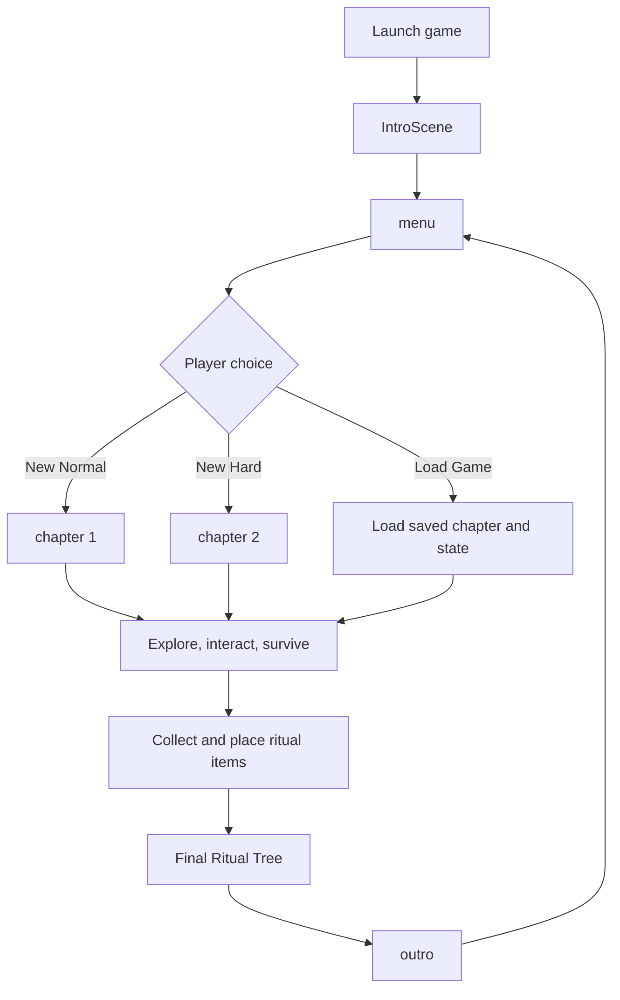
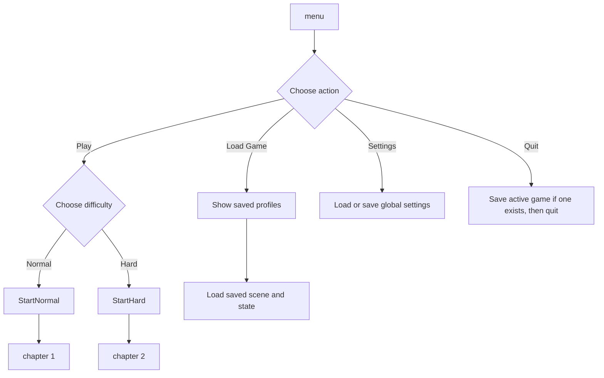
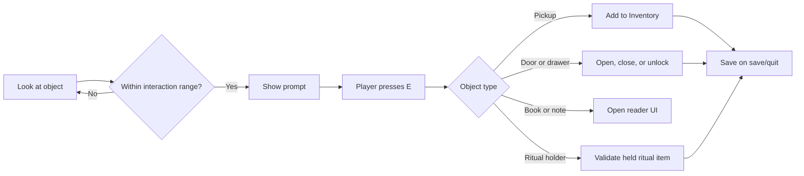
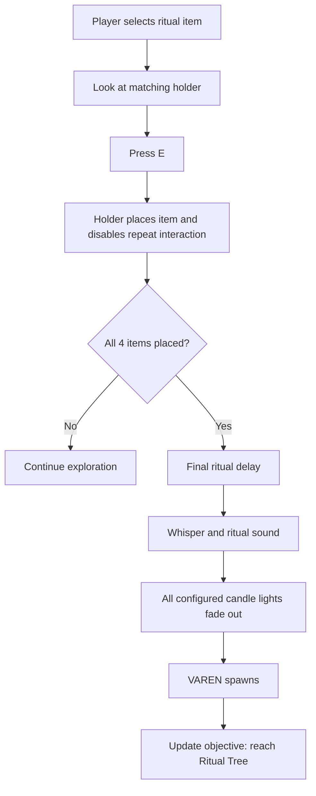
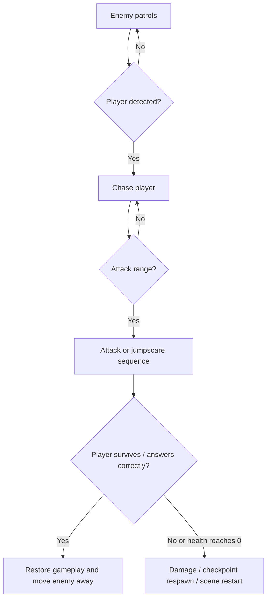
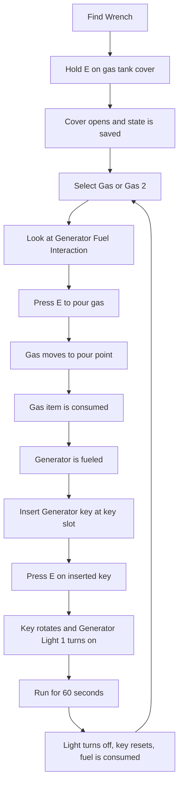
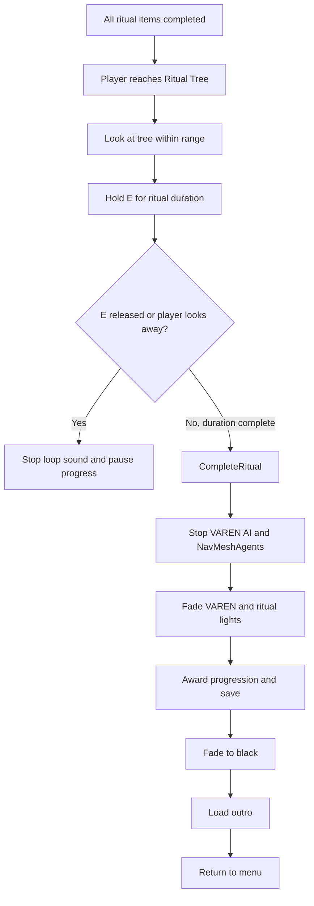
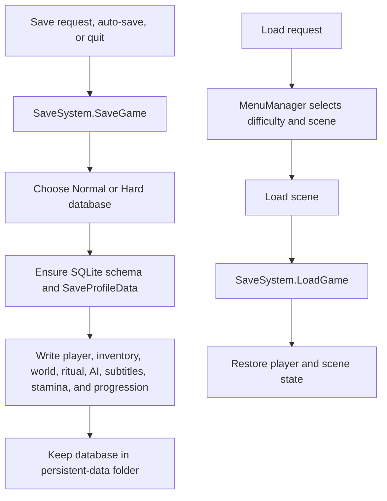

# VAREN Program Workflow

This document describes the current implemented workflow of VAREN, from launch to game completion. It is based on the Unity scenes and C# scripts in this repository.

See the [Activity Diagram](ACTIVITY_DIAGRAM.md) for a compact visual version of this workflow.

See the [Use Case Diagram](USE_CASE_DIAGRAM.md) for the Player-facing system features.

## 1. System Overview

The active build scenes are `IntroScene`, `menu`, `chapter 1`, `chapter 2`, and `outro`.

## 2. Game Startup

1. The game opens `IntroScene`.
2. Intro/video/narration scripts run, then load the `menu` scene.
3. `SettingsDatabase` loads the global `settings.db` row.
4. `SettingsPanel`, `AudioManager`, `MenuLocalization`, and `GameplayLocalization` apply the saved volume, sensitivity, brightness, graphics quality, and language.
5. `MenuManager` checks whether Normal or Hard save data exists and enables the appropriate Load Game buttons.

## 3. Main Menu Workflow

### New Game

- `MenuManager.StartNormal()` selects Normal mode and starts `chapter 1`.
- `MenuManager.StartHard()` selects Hard mode and starts `chapter 2`.
- The selected mode is stored in `PlayerPrefs` as `GameDifficulty`.
- `SaveSystem` selects the matching database, clears the selected mode's new-game state, progression, story intro data, and subtitle data.

### Load Game

- The player selects Normal or Hard mode from the load panel.
- `MenuManager` sets the requested difficulty and scene.
- `SaveSystem.LoadGame()` restores the player, inventory, world objects, doors, ritual state, AI state, subtitle state, stamina, and progression from the matching database.

## 4. Runtime Services

| Service | Main script | Responsibility |
| --- | --- | --- |
| Player movement | `PlayerController` | WASD movement, mouse look, jumping, crouching, sprinting, gravity |
| Inventory | `Inventory`, `BagUI` | Three inventory slots, selection, held-item display, drop and remove actions |
| Interaction | pickup/holder/door/drawer scripts | Raycast-based `E` interactions with scene objects |
| Health and stamina | `PlayerHealth`, `StaminaController` | Damage, health UI, sprint limits, checkpoints and respawn |
| Objectives | `ObjectiveManager`, `ObjectiveTrigger` | Shows the current player goal |
| Audio | `AudioManager`, `AudioTrigger` | Global settings and world sound effects |
| Localization | `MenuLocalization`, `GameplayLocalization` | English, Korean, and Tagalog supported text |
| Saving | `SaveSystem`, `SettingsDatabase` | Game progress databases and global settings database |

## 5. Player Controls and Interaction

1. `PlayerController.Update()` reads movement and mouse input unless a menu, pause panel, or document reader locks input.
2. The camera raycasts toward the center of the screen.
3. An interactable script validates range, required item, and current state.
4. When valid, the script shows a prompt and handles `E` input.
5. The action updates the world, inventory, objective, effects, and save state when applicable.

| Input | Result |
| --- | --- |
| WASD and Mouse | Move and look |
| Left Shift | Sprint |
| Left Ctrl | Crouch |
| Space | Jump |
| E | Interact, pick up, place an item, or hold during an action |
| F | Toggle held flashlight |
| G | Drop selected item |
| Mouse wheel | Change selected inventory slot |
| M | Open map |
| Esc | Pause |

## 6. Exploration and Item Workflow

- Pickup scripts include `PickupItem`, `Key`, `BatteryPickup`, and `FlashlightPickup`.
- `Inventory` holds up to three currently selected scene-object items.
- A dropped item remains in the scene and is written to the save database with its position and rotation.
- `FlashlightPickup` tracks battery level, held state, dropped state, and whether the light is on. On loading, its saved on/off state is restored if the flashlight is held.
- Notes, books, and item subtitles can mark their content as read or triggered so one-time information does not repeat after loading.

## 7. Ritual Item Workflow

The ritual requires four placed items: two candles, a Bible, and a cross.

### Script Responsibilities

- `CandleHolder` accepts a selected candle.
- `TableHolder` accepts the Bible or cross configured for that holder.
- `RitualManager` checks all four holders every frame.
- Once all items are placed, `RitualManager` waits for `Final Ritual Delay` (default: 3 seconds), begins the sound/effect sequence, fades the assigned candle lights, spawns VAREN, and triggers the next objective.
- All static ritual candle `Light` components must be assigned to `RitualManager > Candle Lights` in the Inspector. This ensures every ritual candle turns off.

## 8. Enemy and Damage Workflow

- VAREN uses `MutantAI` or the current enemy controller attached to its prefab; its root movement uses `NavMeshAgent`.
- The White Lady and Tikbalang use their configured AI and trigger scripts.
- `MonsterAI_New` can run a Q-and-A sequence after an encounter. Correct answers restore gameplay; wrong answers or timeout apply penalties.
- `PlayerHealth` applies damage, controls the health UI and blood effect, and works with `CheckpointTrigger` for respawn.

## 9. Chapter 2 Generator Workflow

Chapter 2 adds the gas and generator sequence.

- `GeneratorGasTankCover` requires the wrench and records that the cover is open.
- `GeneratorFuelInteraction` requires an open cover and a selected item named `Gas` or beginning with `Gas `, such as `Gas 2`.
- Gas is animated to the pour point, removed from inventory/scene, and the fueled state is saved.
- `GeneratorKeySlot` requires the Generator key. The inserted key is saved, can be restored after loading, and can start the generator only while fuel is available.
- After the configured run time (default: 60 seconds), the light turns off, the key returns to its original inserted rotation, and the generator consumes its fuel. The player can refuel and run it again.

## 10. Final Ritual Tree Workflow

`RitualTree` prevents repeated completion after success. It disables VAREN's known AI controller and every child `NavMeshAgent` immediately, so VAREN cannot move while the final sequence plays.

## 11. Save, Load, and Quit Workflow

### Databases

| File | Purpose |
| --- | --- |
| `gameSave_v2.db` | Normal-mode save |
| `gameSave_Hard_v2.db` | Hard-mode save, including gas, wrench, and generator-cover data |
| `settings.db` | Shared volume, sensitivity, brightness, graphics quality, and language |

All files are stored under `Application.persistentDataPath`, which is different on Windows, macOS, and Linux. The player save databases use `SaveProfileData` as their parent table; child tables reference it using `SaveProfileId` foreign keys.

## 12. Important Scene and Inspector Setup

The code relies on Inspector references. Verify these before testing a scene:

- `RitualManager`: both candle holders, Bible holder, cross holder, all candle lights, VAREN prefab, spawn point, sounds, and objective trigger.
- `RitualTree`: RitualManager, VAREN scene object/prefab, candle lights, objective trigger, and outro scene name.
- Generator fuel interaction: generator collider, Gas Pour Point, cover save ID, and fuel effect.
- Generator key slot: fuel interaction, key insert point, Generator Light 1, and matching key name.
- Player: camera holder, ground check, health, inventory, pause UI, and checkpoint references.
- SaveSystem: keep one active instance through scene changes.

## 13. Code-to-Feature Map

| Feature | Primary scripts |
| --- | --- |
| Menu and difficulty | `MenuManager`, `MainMenu`, `SceneFader` |
| Settings and language | `SettingsPanel`, `SettingsDatabase`, `MenuLocalization`, `GameplayLocalization` |
| Player | `PlayerController`, `CameraHeadBob`, `PlayerHealth`, `StaminaController` |
| Inventory and pickups | `Inventory`, `BagUI`, `PickupItem`, `Key`, `BatteryPickup`, `FlashlightPickup` |
| World interaction | `DoorInteraction`, `DrawerInteraction`, `Book`, `note`, `KeyUse` |
| Ritual | `CandleHolder`, `TableHolder`, `RitualManager`, `RitualTree` |
| Generator | `GeneratorGasTankCover`, `GeneratorFuelInteraction`, `GeneratorKeySlot` |
| Enemies | `MutantAI`, `MonsterAI_New`, `TikbalangAI`, `JumpscareSystem` |
| Progress and UI | `ObjectiveManager`, `ObjectiveTrigger`, `ProgressionSystem`, `SubtitleManager` |
| Persistence | `SaveSystem`, `SettingsDatabase` |

## 14. Test Checklist

Before a release build, test the following in both Normal and Hard mode:

- Start New Game and Load Game.
- Save, quit, relaunch, and load.
- Pick up, select, drop, and reload every important item.
- Flashlight battery and on/off state after loading.
- Door, drawer, key, note, book, objective, and subtitle persistence.
- Place the two candles, Bible, and cross; verify all four candle lights fade and VAREN spawns after the delay.
- Complete the Ritual Tree; verify VAREN stops, the outro loads, and progression saves.
- In Hard mode, test cover opening, gas pouring, key insertion, 60-second generator operation, refueling, and reload behavior.
- Build and test Save/Load on Windows, macOS, and Linux.