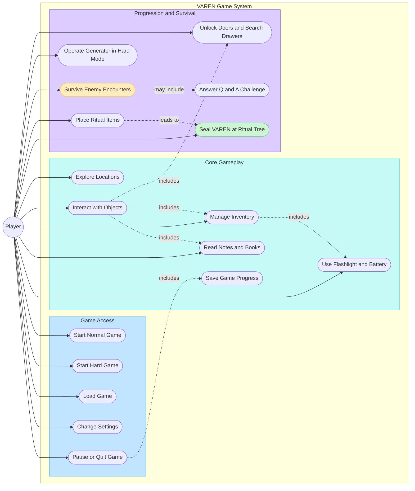

# VAREN Use Case Diagram

This UML-style use case diagram shows what the **Player** can do in the VAREN game system. The diagram is written in Mermaid so GitHub renders it and the source remains editable.

## Actors

| Actor | Description |
| --- | --- |
| Player | The person playing VAREN through the keyboard, mouse, menus, and in-game interaction prompts. |

## Use Case Summary

| Area | Player use cases |
| --- | --- |
| Game access | Start a Normal or Hard game, load progress, change settings, pause, or quit. |
| Exploration | Move through locations, inspect objects, read notes/books, unlock doors, and open drawers. |
| Inventory | Pick up, select, drop, and use items including keys, batteries, flashlight, gas, and ritual items. |
| Survival | Avoid enemies, receive damage, respawn at checkpoints, and complete the Q-and-A sequence when it is triggered. |
| Hard mode | Open the generator cover with the wrench, pour gas, insert the Generator key, and run the generator. |
| Ritual progression | Place two candles, a Bible, and a cross; then hold `E` at the Ritual Tree to seal VAREN. |
| Persistence | Save and load player progress, world state, inventory, rituals, settings, subtitles, and progression. |

## Relationship Notes

- **Includes** means a use case is a required supporting action. For example, interacting with objects includes inventory actions when the object is a pickup.
- **May include** means the Q-and-A challenge occurs only for relevant enemy encounters.
- **Leads to** represents the game progression rule: placing all ritual items unlocks the final Ritual Tree sequence.
- The Player is the only external human actor. SQLite save files are internal game persistence, not a separate player-facing actor.